# 'Edspert Bootcamp' - Educational Quiz App 💡

Independently built an education app using **MVC Architecture** to support Indonesian high school students preparing for univeristy entrance exams.
There are many features on this app that are a built-in forum with sending text and photo functionality using **Cloud Firestore**, full-stack
development with **Flutter**, push notifications for giving the latest information to students using **Firebase Cloud
Messaging** and integrated SSO Authentication. This app was completed within 8 weeks and tested by fellow Bootcamp students with future plans of public deployment.

## Technologies used
- Flutter
- Firebase
- Postman API

## Screenshots

#### This is the Welcome page where the user can Login using their Google Account or Apple ID.
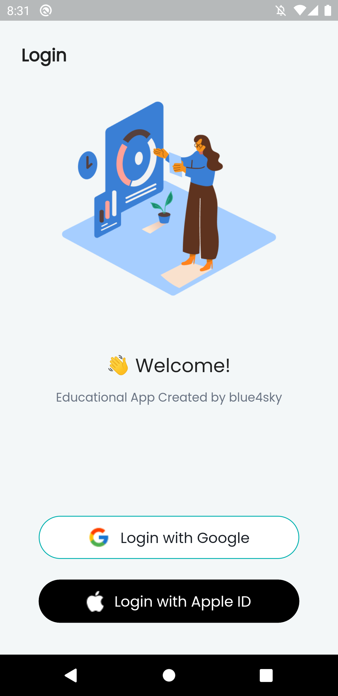

#### This is the Registration page where the user needs to input their details like Full Name, Gender, Class, and School Name.
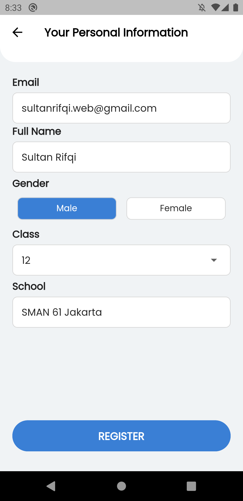

#### This is the Home page which contains the user's name, profile picture, some options for choosing the subject (or seeing all of them), and the latest news, which gives information about promotions from the provider depicted using banner images. At the bottom navigation bar, there are three menus: Home page, Discussion page, and Profile page.
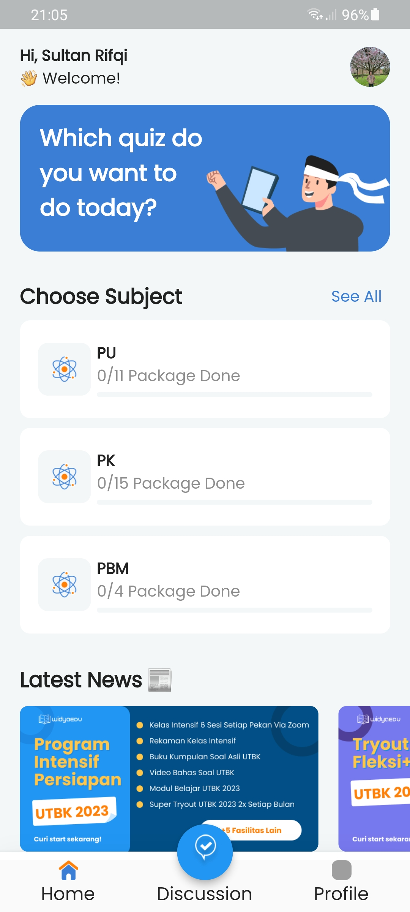

#### This is the Discussion page where the user can interact with other users. They can send a text and a photo (using their own camera).
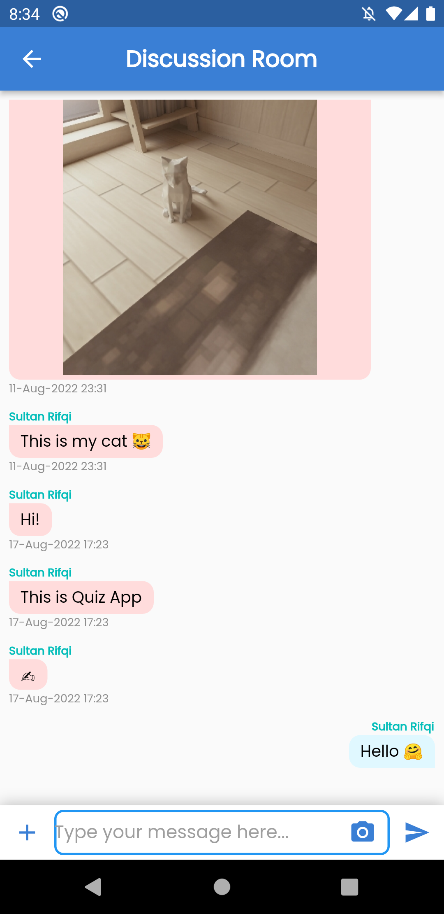

#### This is a page that shows all the quiz subjects that are available on this app.
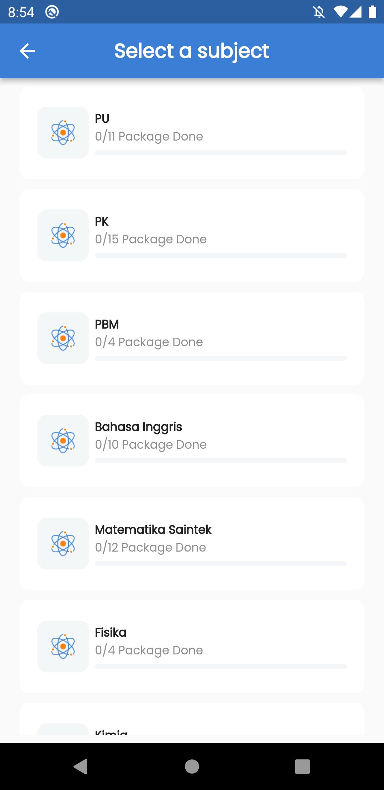

#### This is a page that shows all the topics that are available on the chosen subject.
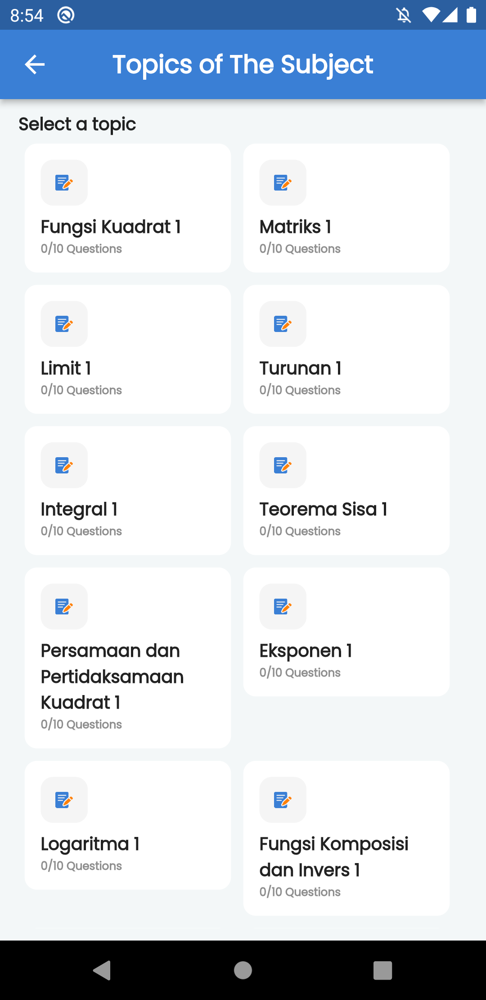

#### This is the Quiz page which contains the question number, the question, the answers (highlighted in blue if the user chooses it), and the Next button to go to the next question.
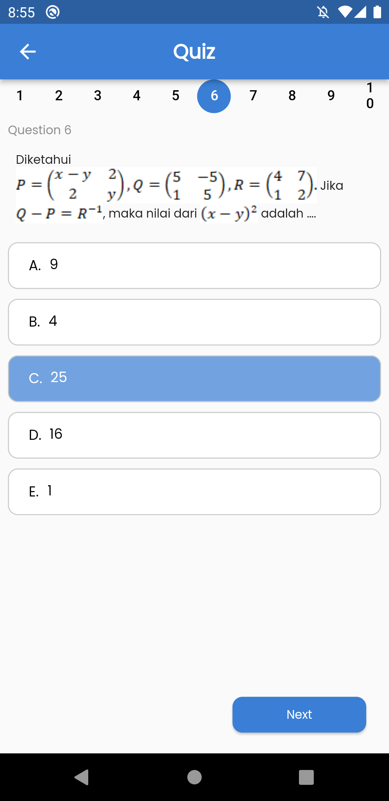

#### This is the bottom sheet confirmation (located on the last question) where the user needs to choose either to submit the answers now or later.
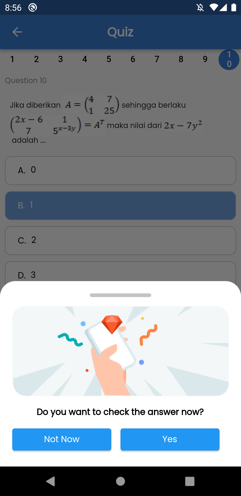

#### This is the Result page where the user can see their score for each quiz and if the user taps the close button, the Home page will be shown.
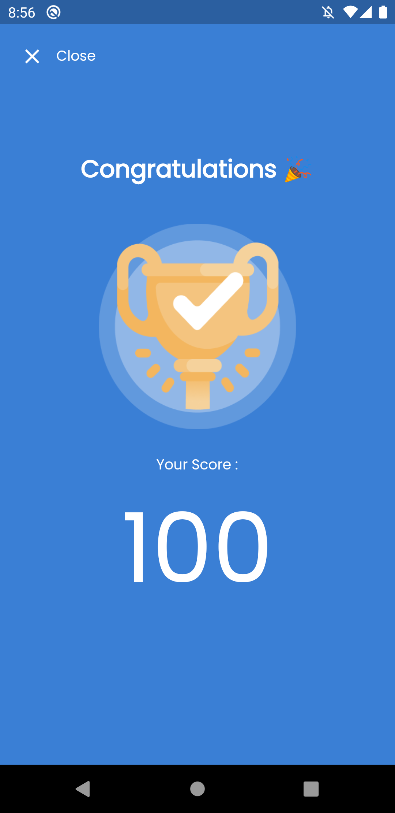

#### This is the Profile page where the user can see their information and edit it. There is also a Log out button on the last row.
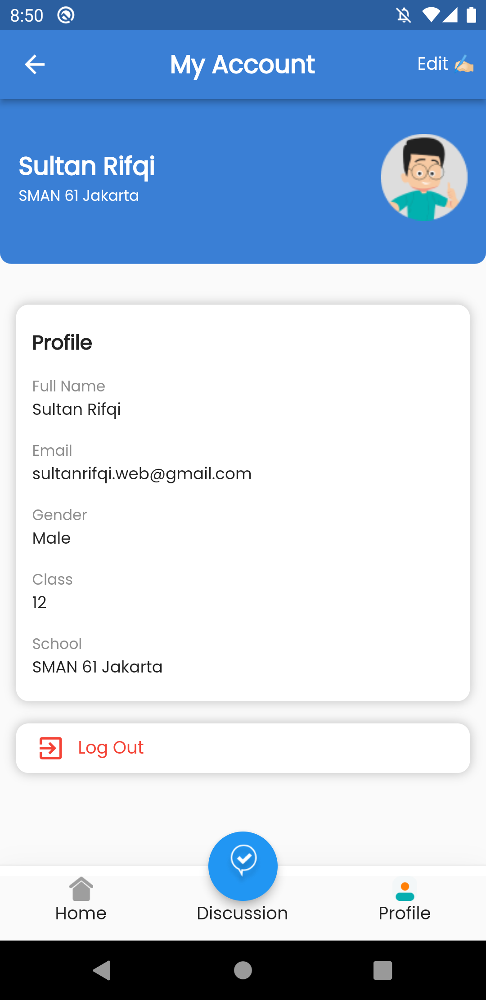

#### This is the Edit Profile page where the user can edit their personal information.
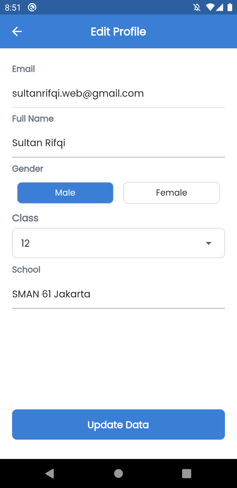

## Download Link
[Give it a try! 📝](https://www.mediafire.com/file/783wia3y8a0lpf8/Quiz_App.apk/file)
